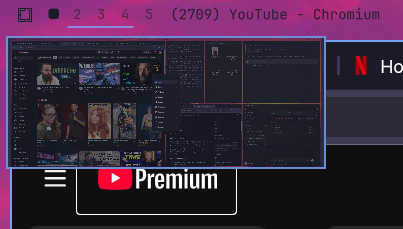

# Workspace Preview

Hover a workspace number in the Omarchy bar to preview that desktop as a thumbnail. The same panel can be summoned from a shortcut.



## Install

```sh
omarchy plugin add https://github.com/leofle/omarchy-workspace-preview.git --enable
```

This plugin is a drop-in replacement for the built-in workspace numbers. Omarchy does not run install scripts, so the swap happens when the plugin is **enabled**: it takes the `omarchy.workspaces` slot on the bar. Disabling or removing this plugin puts the built-in widget back.

If an older install left both sets of numbers on the bar, enable this plugin again after updating (or disable `omarchy.workspaces` once):

```sh
omarchy plugin disable io.github.bubblepaxi.workspace-preview
omarchy plugin enable io.github.bubblepaxi.workspace-preview
```

## Usage

- Hover a workspace number to open its thumbnail.
- Click a number or a preview card to focus that workspace.
- Hovering a workspace refreshes the visible desktop’s cached thumbnail. The popup briefly hides during capture to keep itself out of the image.
- Inactive workspaces show their last captured image; switch to a workspace to refresh its content. Window layout changes also trigger captures.

Summon or hide the panel from a keybinding:

```sh
omarchy-shell shell summon io.github.bubblepaxi.workspace-preview '{}'
omarchy-shell shell hide io.github.bubblepaxi.workspace-preview
```

Example Hyprland binding in `~/.config/hypr/bindings.lua`:

```lua
o.bind("SUPER + TAB", "Workspace Preview", "omarchy-shell shell summon io.github.bubblepaxi.workspace-preview '{}'")
```

## Dependencies

These are already present on a normal Omarchy install:

- Hyprland (`hyprctl`)
- `grim` to capture the focused monitor
- `jq` to choose that monitor
- Python 3 for bounded capture and image validation

Thumbnails are written to `~/.cache/omarchy/workspace-previews/`. No sudo or pkexec is required. The plugin does not install packages and does not change files outside its cache directory.

## Remove

```sh
omarchy plugin remove io.github.bubblepaxi.workspace-preview
```

Removing an enabled copy restores `omarchy.workspaces` in the same bar slot. If the built-in numbers are still missing afterward:

```sh
omarchy plugin enable omarchy.workspaces
```

Cached thumbnails are left in `~/.cache/omarchy/workspace-previews/` and can be deleted by hand.

## License

[MIT](LICENSE)
